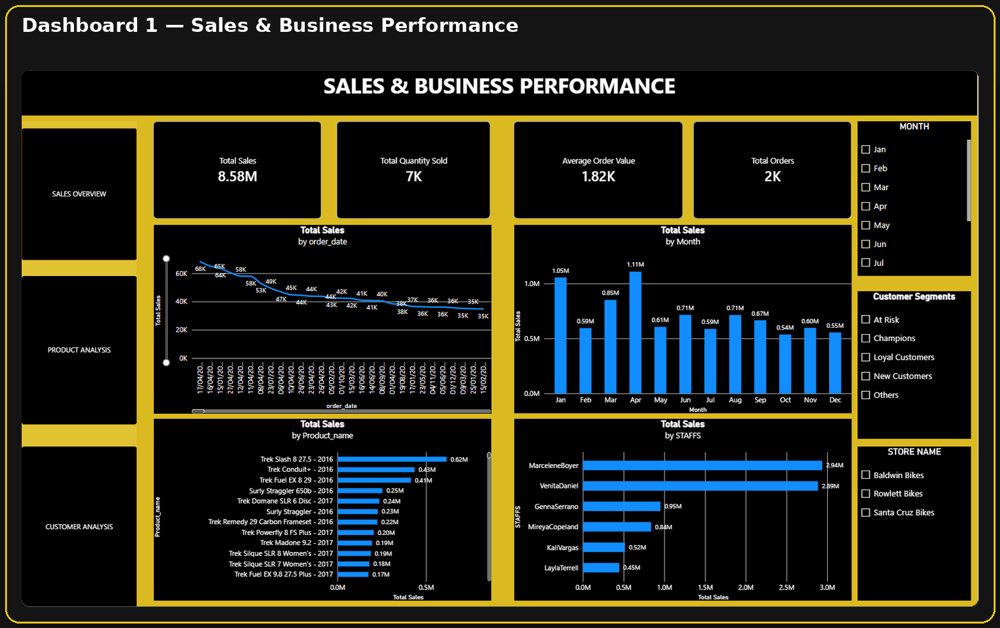
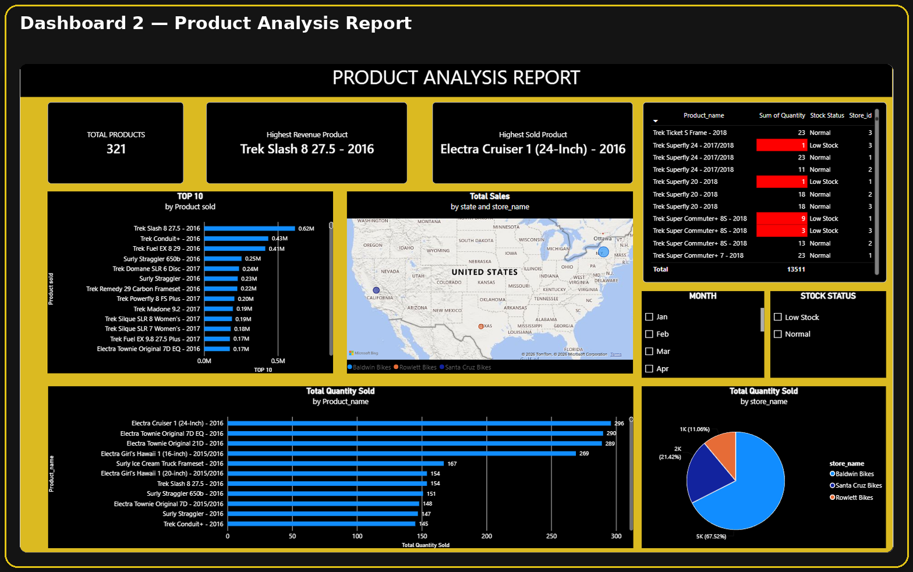
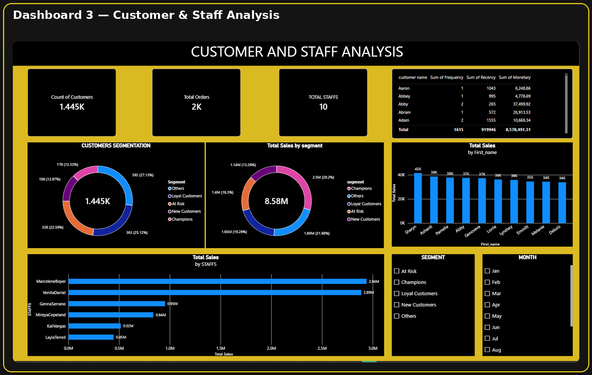

# 📊 Retail Sales Analytics — End-to-End Data Analytics

> An end-to-end retail analytics project covering data cleaning, SQL analysis, Python EDA, RFM customer segmentation, and Power BI reporting.

## 📌 Project Overview

This project transforms retail transaction data into actionable business insights using:

- **Excel** — data cleaning and preparation
- **MySQL** — relational database and SQL analysis
- **Python / Pandas** — EDA and customer analytics
- **RFM Analysis** — customer scoring and segmentation
- **Power BI** — interactive business dashboards

### 🔄 Workflow

```text
Excel Cleaning
     ↓
MySQL Database
     ↓
SQL Analysis
     ↓
Python EDA
     ↓
RFM Analysis
     ↓
Customer Segmentation
     ↓
Power BI Dashboard
```

---

## 🛠️ Key Analysis

### Sales & Business Analysis
- Overall sales and order performance
- Store and staff performance
- Product sales and quantity analysis
- Inventory and low-stock analysis

### Customer Analytics
RFM analysis evaluates customers using:

- **Recency** — how recently a customer purchased
- **Frequency** — number of unique orders
- **Monetary** — total purchase value

RFM metrics are converted into **1–5 quantile-based scores** and classified into business segments such as:

- 🏆 Champions
- 💚 Loyal Customers
- 🆕 New Customers
- ⚠️ At Risk
- 👥 Others

The final analysis contains **1,445 customers**.

---

## 🗄️ Database

The MySQL database contains the main retail entities:

```text
customers
orders
order_items
products
brands
categories
stocks
stores
staffs
```

The EER diagram and SQL resources are available in the repository.

---

## 📁 Repository Structure

```text
retail-sales-analytics-end-to-end/
│
├── Excel/
│   └── Excel_cleaned.xlsx
│
├── SQL/
│   ├── salesdb_final.sql
│   └── eer d.mwb
│
├── Python/
│   └── capstone python (1).ipynb
│
├── Power BI/
│   └── Capstone powerbi.pbix
│
├── PPT and REPORTS/
│   ├── Final Presentation
│   └── Project Report
│
├── rfm_reports/
│   └── RFM analysis reference images
│
├── Screenshots/
│   ├── 01_sales_business_performance.png
│   ├── 02_product_analysis.png
│   ├── 03_customer_staff_analysis.png
│   └── 04_eer_diagram.png
│
└── README.md
```

The supporting RFM screenshots are kept separately in `rfm_reports/` rather than duplicating the entire analysis inside this README.

---

## 📈 Key Outcomes

- Built a complete retail analytics workflow from raw data to business reporting.
- Performed relational SQL analysis across customers, orders, products, stores, staff, and inventory.
- Conducted RFM-based customer segmentation.
- Identified customer groups for retention and engagement analysis.
- Developed Power BI dashboards for sales, product, customer, staff, and inventory insights.

---

## 👨‍💻 Author

**Prasanna Balaji M**  
Data Analyst | Data Science Enthusiast

[GitHub](https://github.com/PrasannaBalaji56/)

---

# 📊 Dashboard Preview

### Sales & Business Performance



### Product Analysis



### Customer & Staff Analysis



---

⭐ **If you find this project useful, consider giving the repository a star.**
