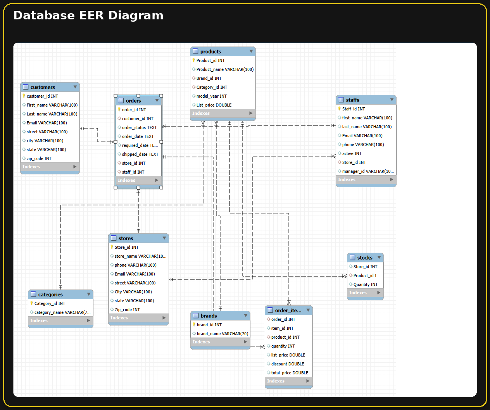
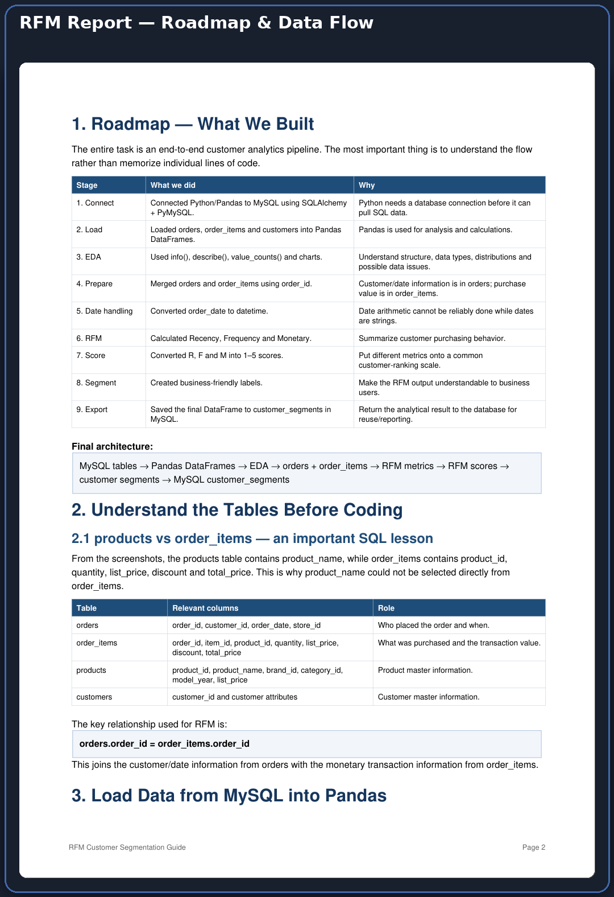
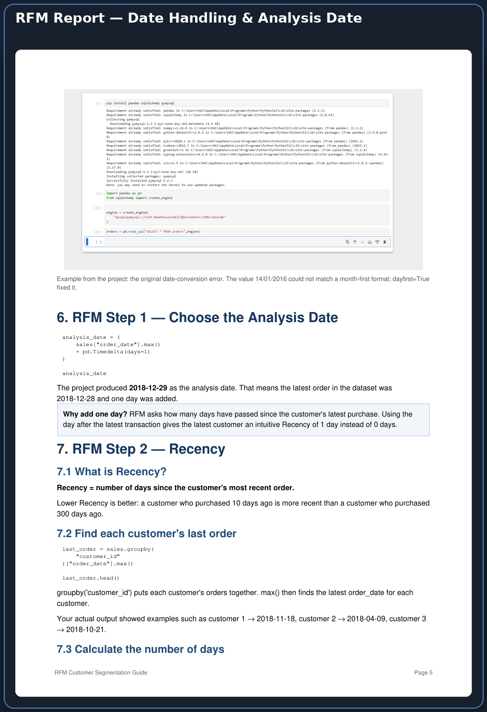
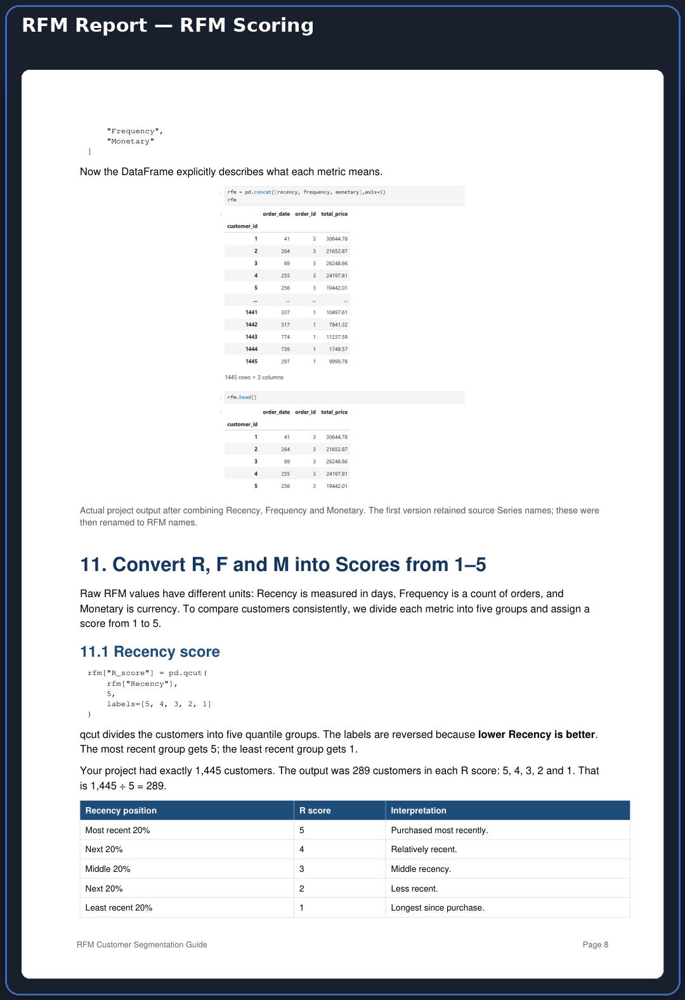
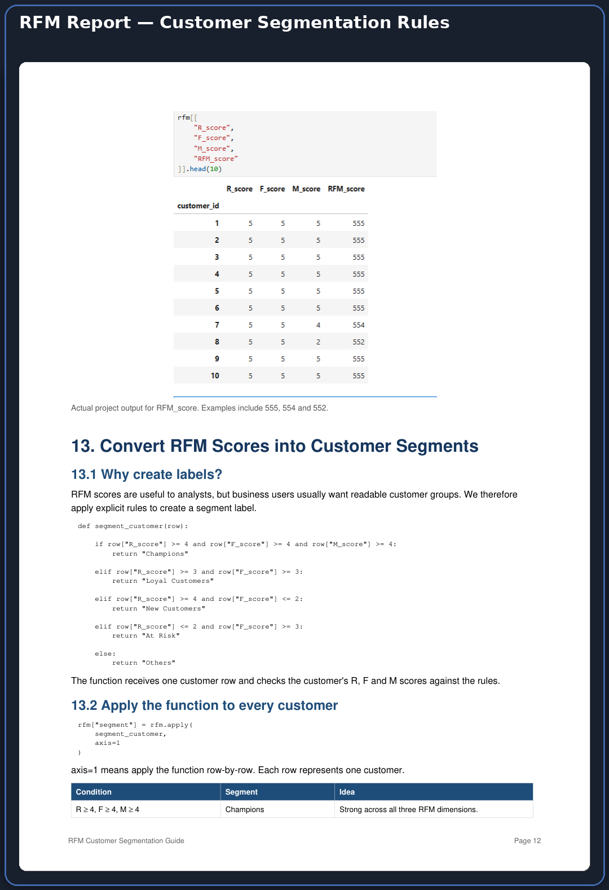
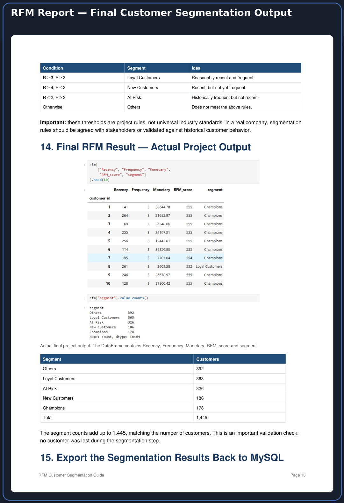
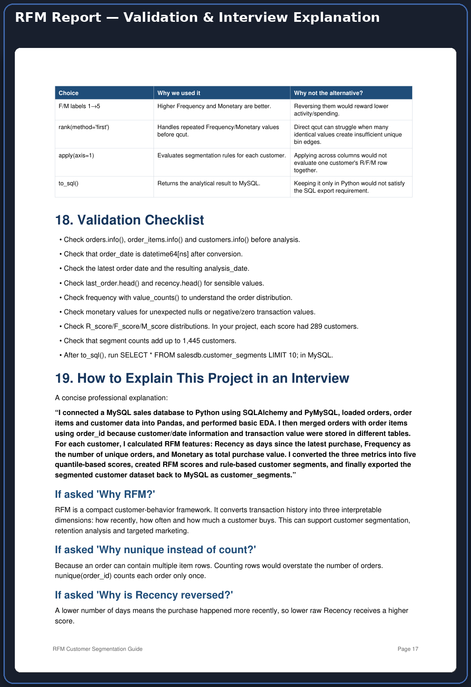

# 📊 Retail Sales Analytics — End-to-End Data Analytics Project


> **A complete retail analytics workflow combining Excel, MySQL, Python, RFM Customer Segmentation and Power BI to turn transactional data into business insights.**

---

## 🖼️ Project at a Glance

This project covers the complete analytics lifecycle:

**Raw Data → Excel Cleaning → MySQL Database → SQL Analysis → Python EDA → RFM Analysis → Customer Segmentation → Power BI Reporting**

### ⭐ Dashboard Preview


---

# 1. 📌 Project Overview

Retail businesses generate large volumes of customer, order, product, store, staff and inventory data. The purpose of this project is to convert that raw operational data into structured analysis and management-level insights.

The project demonstrates an end-to-end workflow using multiple analytics tools:

- 🧹 Excel for data cleaning and preparation
- 🗄️ MySQL for relational data storage and SQL analysis
- 🐍 Python/Pandas for exploratory data analysis
- 👥 RFM for customer behavior analysis
- 🎯 Rule-based customer segmentation
- 📊 Power BI for interactive reporting
- 🧠 Business questions and KPI analysis

---

# 2. 🎯 Business Objectives

The project aims to:

1. Analyze overall retail sales performance.
2. Compare store-level sales performance.
3. Identify top-performing products.
4. Analyze customer purchasing behavior.
5. Identify high-value and at-risk customers.
6. Perform RFM customer segmentation.
7. Analyze staff sales contribution.
8. Monitor inventory and low-stock products.
9. Build interactive Power BI dashboards.
10. Return analytical customer segments to MySQL for reuse in reporting.

---

# 3. 🛠️ Technologies Used

| Technology | Purpose |
|---|---|
| 📗 **Excel** | Data cleaning, lookup operations, pivot analysis and preparation |
| 🗄️ **MySQL** | Relational database, data storage and SQL analysis |
| 🐍 **Python** | Data analysis and customer analytics |
| 🐼 **Pandas** | DataFrames, transformations and RFM calculations |
| 🔢 **NumPy** | Numerical operations |
| 📈 **Matplotlib** | Exploratory visualizations |
| 📊 **Seaborn** | Statistical visualization |
| 🤖 **Scikit-learn** | Available for analytical/ML extensions |
| 📊 **Power BI** | Interactive dashboards and business reporting |
| 🐙 **Git/GitHub** | Version control and project presentation |

> **Implementation note:** The supplied RFM workflow uses **quantile-based RFM scoring and explicit rule-based segmentation**. It does not require a K-Means model for the final customer segment labels.

---

# 4. 🔄 End-to-End Workflow

```text
                 📦 RAW RETAIL DATA
                         │
                         ▼
                📗 EXCEL CLEANING
             Cleaning + Validation
                         │
                         ▼
                  📄 CLEAN DATA
                         │
                         ▼
                   🗄️ MYSQL
             Database + SQL Analysis
                         │
                         ▼
                   🐍 PYTHON
              EDA + Data Preparation
                         │
                         ▼
                   👥 RFM ANALYSIS
          Recency + Frequency + Monetary
                         │
                         ▼
                  🎯 RFM SCORING
                     Scores 1–5
                         │
                         ▼
             👤 CUSTOMER SEGMENTATION
                         │
                         ▼
                🗄️ MYSQL EXPORT
              customer_segments
                         │
                         ▼
                  📊 POWER BI
          Dashboard + Business Insights
```

The RFM report documents the same core sequence as:

**DATA → PREPARE → RFM → SCORE → SEGMENT → STORE**.

---

# 5. 📂 Dataset Structure

The project uses a relational retail database containing:

- `customers`
- `orders`
- `order_items`
- `products`
- `brands`
- `categories`
- `stocks`
- `stores`
- `staffs`

### 📋 Table Overview

| Table | Description |
|---|---|
| `customers` | Customer information and location |
| `orders` | Customer transaction/order information |
| `order_items` | Individual products purchased in each order |
| `products` | Product master information |
| `brands` | Product brand information |
| `categories` | Product category information |
| `stocks` | Product inventory by store |
| `stores` | Store information |
| `staffs` | Staff information |

---

# 6. 🧹 Phase 1 — Excel Data Cleaning

Excel was used as the initial data preparation layer.

### 🔧 Tasks Performed

- Standardized column names
- Removed duplicate records
- Handled missing values
- Converted data types
- Validated data consistency
- Created derived columns
- Used VLOOKUP/XLOOKUP
- Created pivot tables
- Investigated pricing values/outliers
- Prepared cleaned data for SQL import

### 🧮 Example Calculation

```text
Total Price = (List Price × Quantity) - Discount
```

> If `Discount` is stored as a percentage rather than an absolute amount, the corresponding calculation should be `List Price × Quantity × (1 - Discount)`.

---

# 7. 🗄️ Phase 2 — MySQL Database & SQL Analysis

The cleaned datasets were loaded into a relational MySQL database.

### 🔧 SQL Work Performed

- Database creation
- Table creation
- Primary keys
- Foreign keys
- Data loading
- Relational joins
- Aggregations
- `GROUP BY`
- Filtering
- Sorting
- Customer purchase analysis
- Store sales analysis
- Product performance
- Staff performance
- Inventory analysis

### 🔗 Important Relationships

The RFM workflow joins:

```text
orders.order_id = order_items.order_id
```

This combines customer/order-date information from `orders` with transaction-value information from `order_items`.

### 🗺️ EER Diagram



The EER diagram shows the relational structure connecting customers, orders, products, stores, staff, brands, categories, stocks and order items.

---

# 8. 🐍 Phase 3 — Python Exploratory Data Analysis

Python and Pandas were used to load data from MySQL and perform exploratory analysis.

### 📚 Main Libraries

```python
import pandas as pd
import numpy as np
import matplotlib.pyplot as plt
import seaborn as sns
from sqlalchemy import create_engine
```

### 🔎 EDA Activities

- Dataset inspection
- Data type checking
- Descriptive statistics
- Frequency analysis
- Order distribution
- Quantity distribution
- Basic visualizations
- Data preparation for RFM

Common checks:

```python
orders.info()
order_items.info()
customers.info()

orders.describe()
order_items.describe()

orders["store_id"].value_counts()
```

---

# 9. 👥 Phase 4 — RFM Customer Analysis

RFM analysis converts transaction history into three customer-behavior dimensions.

### 🔵 Recency

How recently did the customer purchase?

```text
Recency = Analysis Date - Customer's Latest Order Date
```

Lower Recency is better because fewer days means a more recent purchase.

### 🟢 Frequency

How many distinct orders did the customer make?

```text
Frequency = Number of Unique Order IDs
```

`nunique()` is used because one order can contain multiple item rows.

### 🟠 Monetary

How much did the customer spend?

```text
Monetary = Sum of Total Purchase Value
```

The RFM report records the project analysis date as **2018-12-29**, based on the latest transaction date plus one day.

---

# 10. 📊 RFM Scoring

Raw RFM values use different units, so each metric is converted into a score from **1 to 5** using quantile-based grouping.

### 🔵 Recency Score

```python
rfm["R_score"] = pd.qcut(
    rfm["Recency"],
    5,
    labels=[5, 4, 3, 2, 1]
)
```

The labels are reversed because lower Recency is better.

### 🟢 Frequency Score

```python
rfm["F_score"] = pd.qcut(
    rfm["Frequency"].rank(method="first"),
    5,
    labels=[1, 2, 3, 4, 5]
)
```

Higher Frequency receives a higher score.

### 🟠 Monetary Score

```python
rfm["M_score"] = pd.qcut(
    rfm["Monetary"].rank(method="first"),
    5,
    labels=[1, 2, 3, 4, 5]
)
```

Higher Monetary value receives a higher score.

### 🔢 Combined RFM Score

```text
RFM_score = R Score + F Score + M Score
```

Example:

```text
555
554
552
234
111
```

`555` represents a customer in the highest scoring group across Recency, Frequency and Monetary. It is **not** 555 purchases or a currency amount.

### 🖼️ RFM Report Images













---

# 11. 🎯 Customer Segmentation

After scoring, explicit business rules convert RFM scores into readable customer segments.

### 🏆 Champions

```text
R >= 4 AND F >= 4 AND M >= 4
```

Strong across all three RFM dimensions.

### 💚 Loyal Customers

```text
R >= 3 AND F >= 3
```

Reasonably recent and frequent customers.

### 🆕 New Customers

```text
R >= 4 AND F <= 2
```

Recent customers who have not yet purchased frequently.

### ⚠️ At Risk

```text
R <= 2 AND F >= 3
```

Historically frequent customers who are no longer recent.

### 👥 Others

Customers who do not meet the previous rules.

> These thresholds are **project-specific rules**, not universal industry standards.

---

# 12. 📈 Actual RFM Segmentation Result

The final project output contains **1,445 customers**.

| Segment | Customers |
|---|---:|
| 👥 Others | 392 |
| 💚 Loyal Customers | 363 |
| ⚠️ At Risk | 326 |
| 🆕 New Customers | 186 |
| 🏆 Champions | 178 |
| **Total** | **1,445** |

The segment counts add up to the full 1,445-customer population, providing an important validation check.

---

# 13. 🗄️ Exporting Customer Segments Back to MySQL

The final RFM DataFrame is exported to MySQL as:

```text
customer_segments
```

The resulting table contains:

```text
customer_id
Recency
Frequency
Monetary
RFM_score
segment
```

Example:

```python
rfm.to_sql(
    "customer_segments",
    con=engine,
    if_exists="replace",
    index=True
)
```

---

# 14. 📊 Phase 5 — Power BI Dashboard

Power BI was used to create three analytical dashboard pages.

## 14.1 💰 Sales & Business Performance

- Total Sales
- Total Quantity Sold
- Average Order Value
- Total Orders


## 14.2 🛍️ Product Analysis Report

- Total Products
- Highest Revenue Product
- Highest Sold Product


## 14.3 👥 Customer & Staff Analysis

- Customer Count
- Total Orders
- Total Staff


---

# 15. 🗺️ Database EER Diagram


---

# 16. 📚 RFM Learning / Documentation

The RFM guide covers:

- MySQL → Pandas connection
- Loading SQL tables
- EDA
- Merging `orders` and `order_items`
- Date conversion
- Analysis date
- Recency calculation
- Frequency calculation
- Monetary calculation
- RFM scoring
- Customer segmentation
- Validation
- Export back to MySQL
- Interview explanation

📄 The complete RFM guide is included in:

```text
docs/RFM_Customer_Segmentation_Full_Guide.pdf
```

---

# 17. 📈 Key Business Questions Answered

## 💵 Sales

- What is the total sales value?
- How do sales change over time?
- Which stores generate the highest sales?
- Which products generate the most sales?
- What is the average order value?
- Which months contribute the most sales?

## 👥 Customers

- Who are the high-value customers?
- How recently did customers purchase?
- How frequently do customers purchase?
- How much do customers spend?
- Which customers are at risk?
- What are the major customer segments?
- Which segment generates the highest revenue?

## 🛍️ Products

- Which products sell the most?
- Which products generate the highest revenue?
- Which products have low stock?
- Which categories/products contribute strongly to sales?

## 🏪 Stores

- Which stores perform best?
- How does quantity sold vary by store?
- How does revenue vary across stores?

## 👨‍💼 Staff

- Which staff members contribute the most revenue?
- How does staff performance vary?

## 📦 Inventory

- Which products are low in stock?
- Which stores contain low-stock products?
- Which products may need restocking?

---

# 18. 📊 Key KPIs

| KPI | Business Meaning |
|---|---|
| 💰 Total Sales | Overall sales value |
| 🛒 Total Orders | Number of customer orders |
| 📦 Total Quantity Sold | Units sold |
| 💵 Average Order Value | Average value per order |
| 🛍️ Total Products | Number of products in analysis |
| 👥 Customer Count | Number of customers analyzed |
| 👨‍💼 Total Staff | Number of staff members |
| ⚠️ Low Stock | Products below the defined stock threshold |

---

# 19. 🧠 Skills Demonstrated

### 📊 Data Analytics
- Data Cleaning
- Data Preprocessing
- Exploratory Data Analysis
- Business Analysis
- KPI Analysis
- Data Visualization

### 📗 Excel
- VLOOKUP
- XLOOKUP
- Pivot Tables
- Data Cleaning
- Derived Columns
- Data Validation

### 🗄️ SQL
- Database Design
- Relational Data Modeling
- Primary Keys
- Foreign Keys
- INNER JOIN
- GROUP BY
- Aggregations
- Filtering
- Sorting
- Business Analysis

### 🐍 Python
- Pandas
- NumPy
- Matplotlib
- Seaborn
- Data Transformation
- Exploratory Data Analysis

### 👥 Customer Analytics
- RFM Analysis
- Recency
- Frequency
- Monetary
- Quantile Scoring
- Customer Segmentation

### 📊 Power BI
- Data Modeling
- KPI Cards
- Interactive Dashboards
- Slicers
- Filters
- Sales Analysis
- Product Analysis
- Customer Analysis
- Inventory Analysis
- Staff Analysis

---

# 20. 🎓 Project Context

This project was completed as part of Data Analytics training at **Vinsup Skill Academy**.

### 📌 Domain

```text
Retail
Sales Analytics
Customer Analytics
Inventory Analytics
Business Intelligence
```

---

# 21. 👨‍💻 Author

## Prasanna Balaji M

**Data Analyst | Data Science Enthusiast**

### 🔗 GitHub

https://github.com/PrasannaBalaji56/

---

# 22. 💼 Interview Explanation

> “I worked on an end-to-end retail analytics project where I cleaned and prepared data using Excel, loaded it into a MySQL relational database, and performed SQL-based business analysis. I then connected MySQL to Python using SQLAlchemy and PyMySQL, loaded orders, order items and customer data into Pandas, and performed EDA. For customer analytics, I calculated Recency, Frequency and Monetary metrics, converted them into five quantile-based scores, created rule-based customer segments, and exported the final customer segmentation back to MySQL. Finally, I used Power BI to build interactive dashboards covering sales, products, customers, stores, staff and inventory.”

---

# 23. ⭐ Conclusion

This project demonstrates how raw retail data can be transformed into meaningful business intelligence through a complete analytics pipeline.

```text
📦 DATA
   ↓
🧹 CLEAN
   ↓
🗄️ STORE
   ↓
🔎 ANALYZE
   ↓
👥 SEGMENT
   ↓
📊 VISUALIZE
   ↓
💡 DECIDE
```

The project combines technical data skills with business-oriented analysis and demonstrates the ability to work across **Excel → SQL → Python → RFM → Power BI**.

---

## ⭐ If you find this project useful, consider giving the repository a star!
